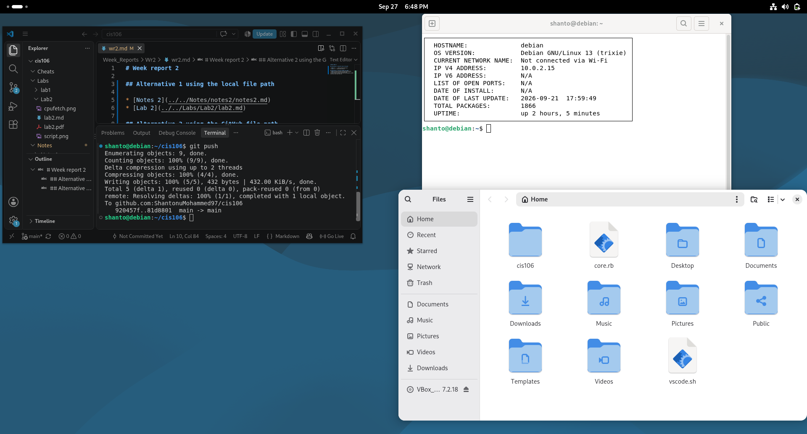

# Week report 2

## Alternative 1 using the local file path

* [Notes 2](../../Notes/notes2/notes2.md)
* [Lab 2](../../Labs/Lab2/lab2.md)

## Alternative 2 using the GitHub file path
* [Notes 2](https://github.com/ShantonuMohammed97/cis106/blob/main/Notes/notes2/notes2.md)
* [Lab 2](https://github.com/ShantonuMohammed97/cis106/blob/main/Labs/Lab2/lab2.md)

## Deabian Desktop
